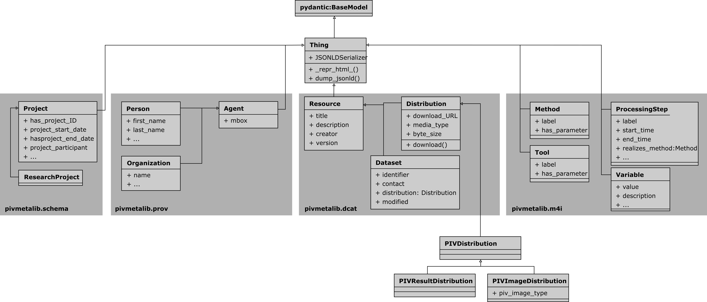

# pivmetalib


A Python library and high-level interface to work with the [pivmeta ontology](https://matthiasprobst.github.io/pivmeta/)
. It allows to describe PIV recordings, software, hardware and other related entities in a state of the art and good
scientific practice compliant way.

Put the resulting JSON-LD to your website, data repository or other places to make your data FAIR. Other users or
software can then easily find, understand and use your data.

Example:

```python
from pivmetalib import pivmeta, prov

software = pivmeta.PIVSoftware(
    author=prov.Organisation(
        name='OpenPIV',
        url='https://github.com/OpenPIV/openpiv-python',
    ),
    description='OpenPIV is an open source Particle Image Velocimetry analysis software written in Python and Cython',
    softwareVersion="0.26.0a0",
    has_documentation='https://openpiv.readthedocs.io/en/latest/',
)

from pprint import pprint

pprint(software.model_dump(exclude_none=True)
```

This will result in the following JSON-LD representation:

```bash
{
    "@context": {
        "@import": "https://raw.githubusercontent.com/matthiasprobst/pivmeta/main/pivmeta_context.jsonld"
    },
    "@graph": [
        {
            "@id": "https://local-domain.org/9c0696ff-7b0f-43a5-9d36-afca62f0f374",
            "@type": "prov:Organisation",
            "foaf:name": "OpenPIV",
            "schema:url": "https://github.com/OpenPIV/openpiv-python"
        },
        {
            "@id": "https://local-domain.org/82675f3e-8887-4a76-a62c-cc1119857735",
            "@type": "Piv Software",
            "schema:author": {
                "@id": "https://local-domain.org/9c0696ff-7b0f-43a5-9d36-afca62f0f374"
            },
            "schema:description": "OpenPIV is an open source Particle Image Velocimetry analysis software written in Python and Cython",
            "schema:softwareVersion": "0.26.0a0",
            "sd:hasDocumentation": "https://openpiv.readthedocs.io/en/latest/"
        }
    ]
}
```

## Installation

Currently, the library is not available on PyPI. Thus, you can install it directly from GitHub:

```bash
pip install git+https://github.com/matthiasprobst/pivmetalib.git
```

## Documentation and Usage

This library mainly implements the ontology in form of `pydantic` model classes. The *pivmeta* ontology uses other
ontologies and builds on top of them. Thus, some central classes from ontologies like *schema.org*, *prov*, *dcat* and
*m4i* are implemented, too. Have a look at the class diagram below (it may not be complete yet but gives a first idea).

Practical examples on how to use the library can be found in docs-folder (
e.g. [Describe a PIV recording](docs/Describe_a_PIV_recording.ipynb)).



## Contribution

Contributions are welcome. Please open an issue or a pull request.


